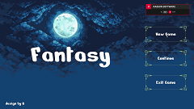

# UnityDemo
(｡･∀･)ﾉﾞ嗨，你好，这是我的2D类银河恶魔城测试项目。

创建这个仓库的初衷是为了借此熟悉游戏开发流程，以便更好找到工作。还不太会markdown，所以界面有点粗糙......

github仓库中放了release包，里面有我打包好的运行程序，**下载打开就能进行游玩**。不过目前还没有达到游玩标准，先标记为v0.1.0，后续我会继续更新的。

**目前重点在于走通unity开发到发布整个流程，重点在代码实现上**。

目前已完成的功能如下：

- [x] 使用继承和多态的模式创建Entity类，并由此迭代开发Enemy和Player，分别作为敌人和玩家，以便共享一些基本内容。
- [x] 使用排他有限状态机（即一次只能进入一个状态）设计玩家和敌人。
- [x] 玩家具备基本移动、跳远、蹬墙、三段战斗和反击等基本功能，支持血条以及简单UI显示。
- [x] 敌人具备待机、移动、攻击、可被反击等基本功能，支持血条显示实时血量。
- [x] 基本的地形、背景、菜单UI设置。

后续要继续实现的功能如下：

- [ ] 使用行为树进行一场BOSS战的头目AI逻辑。🚀
- [ ] 使用有限状态机/行为树设计一个队友NPC的行为逻辑。👌
- [ ] 加入BOSS战死亡后进行时间回溯，快速回顾战斗行为并回到初遇BOSS。（因为感觉这个很酷，代码也有点含金量，而且这样可以死了直接重开BOSS战）😋

## 一、完成功能介绍

通过unity自带的打包工具构建exe游玩程序，并通过动画状态机实现简单的界面淡入淡出效果。

点击开始游戏，切换到主场景，进入游戏。目前测试场景共两个角色，可操控的玩家和不可操控的敌人。

玩家可通过wasd进行基本移动操作，后面的背景会随着玩家移动进行移动切换，以实现人物真的在移动的效果。

玩家可通过space键进行基本跳跃功能

没踩在ground标记的可碰撞物体时，会下坠，下面绑定了一个标记了trigger的盒子，玩家越过就死了。弹出死亡菜单，点击重新游戏。

当进入敌人视野时，敌人进行警戒状态，会超玩家所在位置进行移动。当判定攻击距离大于检测射线时，发动攻击。（这里是用双射线检测，避免跟在敌人身后又不察觉的问题）。同时使用携程设置了一个被攻击时变白色的效果。

玩家可以通过跳上高台躲避敌人的视野，当检测射线距离过长或敌人警戒时间结束，敌人重新恢复巡逻状态，解除敌意。

玩家可以通过躲避闪开攻击，敌人的攻击范围和动画显示绑定契合，当攻击未触碰到玩家碰撞器时，不会触发伤害。

玩家拥有三段连续攻击，第三段连续攻击会发生轻微位移，以增强打击效果。

玩家可以通过把握敌人攻击帧进行反击。我为敌人设置了一个可被反击的窗口，当窗口出现，敌人会出现红色圆块代表可被反击，此时按下鼠标右键进行反击状态，检测到敌人攻击自动反击，并触发敌人僵直效果。

敌人血条见0，敌人触发死亡状态，同时把敌人丢进对象池，不销毁，以便后续继续使用。

当玩家跳跃靠近墙体，进行爬墙动画，保留y轴速度，以实现下滑效果。按住s键，可以加快下滑速度。

实现了基本的蹬墙跳，并优化了手感。

点击esc弹出玩家菜单，点击返回按钮返回主界面，点击退出退出游戏，并保存用户存档。

## 二、实现逻辑分析

待施工🚧

## 三、未来功能设计

待施工🚧

