# Unity2DDemo

感谢原始项目：[https://github.com/Destiny951/UnityDemo]

本项目主要基于原有功能做一些简单改动，以下为原有项目README：

----------------- 

目前DEMO的重点如下：**

- ⭐走通unity开发到发布整个流程。
- ⭐⭐掌握游戏的基本开发，包括敌人和玩家的设计。
- ⭐⭐⭐实现BOSS战和一些特殊机制。

目前已完成的功能如下：

- [x] **对象池**:使用继承和多态的模式创建Entity类，并由此迭代开发Enemy和Player。使用对象池对敌人进行管理（增删），使用单例模式管理player。
- [x] **有效状态机**:使用排他有限状态机（即一次只能进入一个状态）设计玩家和敌人。
- [x] **行为树**:使用行为树+状态机混合，设计BOSS的初步AI逻辑。（BOSS采用空洞骑士的假骑士BOSS战，使用的精灵表是网上开源的）
- [x] **镜头控制**：包括主镜头和BOSS战镜头的平滑切换（借用CineCamera插件），BOSS战的镜头摇晃。
- [x] **系统事件**：包括进入BOSS战的开关门事件，敌人死亡的广播事件等等。
- [x] **存档系统**：利用序列和反序列存储游戏数据，创建GameData类存放游戏数据，并通过单例模式进行存储和加载。

玩家具备基本移动、跳远、蹬墙、三段战斗和反击等基本功能，支持血条以及简单UI显示；敌人具备待机、移动、攻击、可被反击等基本功能，支持血条显示实时血量；基本的地形、背景、菜单UI设置。

所涉及的美术资源和代码参考如链接所示：https://www.udemy.com/course/2d-rpg-alexdev/，

在此郑重对发布这个视频的原作者和UP主进行感谢。这是一个相当优秀的unity入门教程，帮助我在短时间内了解unity。

**但我保证，项目中的代码都是我自己在理解后的基础上自己编写的！！！**

部分如敌人视野检测、蹬墙跳逻辑并未参考作者的写法，因为感觉作者的实现逻辑和我的想法有冲突，所以自己重新实现了。

另外原教程中涉及关于玩家的技能树和物品栏等内容我没有去实现，因为**本项目的重点在于设计一场初步具备AI逻辑行为的BOSS战**。据我了解，一些决策树等基本的机器学习算法已经成功运用在了BOSS战上，对这方面进行深入了解比较符合我的兴趣。

后续要继续实现的功能如下：

- [x] 使用行为树进行一场BOSS战的头目AI逻辑。🚀 **（已完成）**
- [ ] 使用有限状态机/行为树设计一个队友NPC的行为逻辑。👌
- [ ] 加入BOSS战死亡后进行时间回溯，快速回顾战斗行为并回到初遇BOSS。（因为感觉这个很酷，代码也有点含金量，而且这样可以死了直接重开BOSS战）😋

## 一、基本功能介绍

   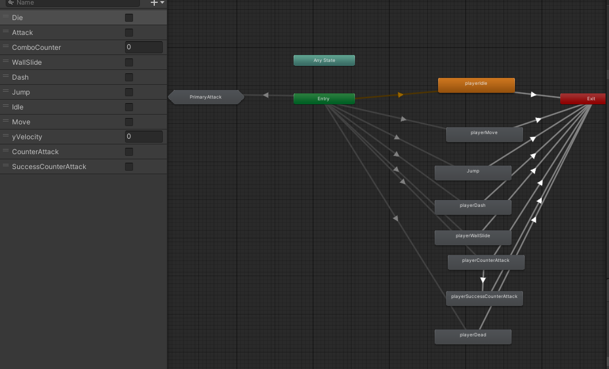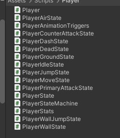

通过unity自带的打包工具构建exe游玩程序，并通过动画状态机实现简单的界面淡入淡出效果。展示玩家动画状态机和写的一些脚本，使用State控制状态的进入、更新和退出，stateMachine控制玩家当前状态和下一个状态，player脚本负责调用stateMachine进入状态。

      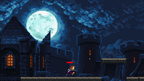 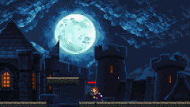

玩家可通过wasd进行基本移动操作，后面的背景会随着玩家移动进行移动切换，以实现人物真的在移动的效果；玩家可通过space键进行基本跳跃功能；没踩在ground标记的可碰撞物体时，会下坠，下面绑定了一个标记了trigger的盒子，玩家越过就死了。弹出死亡菜单，点击重新游戏。

   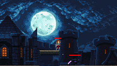    

当进入敌人视野时，敌人进行警戒状态，会超玩家所在位置进行移动。当判定攻击距离大于检测射线时，发动攻击。（这里是用双射线检测，避免跟在敌人身后又不察觉的问题）。同时使用携程设置了一个被攻击时变白色的效果。

玩家可以通过跳上高台躲避敌人的视野，当检测射线距离过长或敌人警戒时间结束，敌人重新恢复巡逻状态，解除敌意。

玩家可以通过躲避闪开攻击，敌人的攻击范围和动画显示绑定契合，当攻击未触碰到玩家碰撞器时，不会触发伤害。

   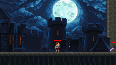    

玩家拥有三段连续攻击，第三段连续攻击会发生轻微位移，以增强打击效果。

玩家可以通过把握敌人攻击帧进行反击。我为敌人设置了一个可被反击的窗口，当窗口出现，敌人会出现红色圆块代表可被反击，此时按下鼠标右键进行反击状态，检测到敌人攻击自动反击，并触发敌人僵直效果。

敌人血条见0，敌人触发死亡状态，同时把敌人丢进对象池，不销毁，以便后续继续使用。

      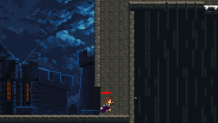 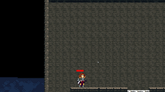

当玩家跳跃靠近墙体，进行爬墙动画，保留y轴速度，以实现下滑效果。按住s键，可以加快下滑速度。

实现了基本的蹬墙跳，并优化了手感。

点击esc弹出玩家菜单，点击返回按钮返回主界面，点击退出退出游戏，并保存用户存档。

## 二、使用行为树进行BOSS的设计

   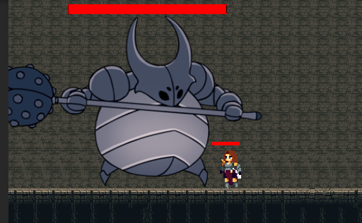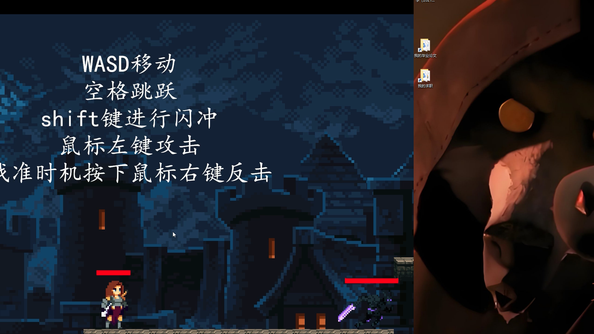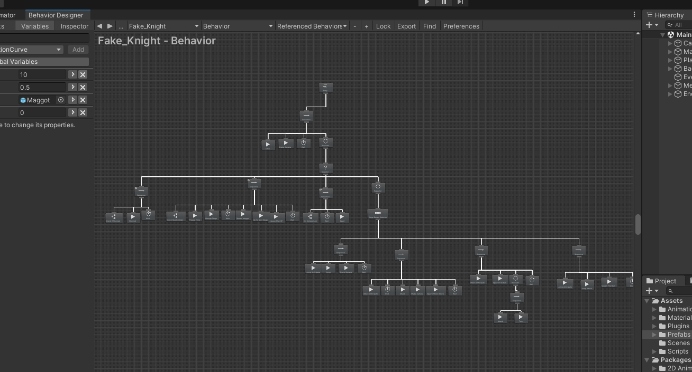

使用空洞骑士的假骑士资源完成了一场boss战的设计。中间的图是给之前的初始场景增加提示词，简单告知玩家可以进行的操作。右图是boss行为树的构建。

**全部代码自己完成！**

### 2.1BOSS战三阶段设计介绍

   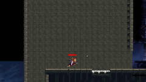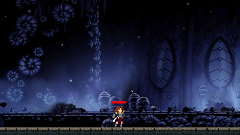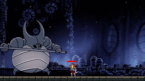

第一阶段：

​	玩家进行BOSS房间，**触发关门事件**，锁门不让玩家出去，同时进行**镜头调控**，平滑过渡到更小的摄像机尺寸，以便加强boss战斗的细节和临场感；

​	在等待几秒之后，BOSS从天而降入场，砸地产生**镜头抖动**，增强战斗刺激性；boss的一阶段只会跳跃攻击，当砸到玩家身上会扣血，同时砸到地面同样会造成镜头抖动；

   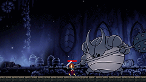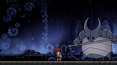

第二阶段：

​	玩家将第一阶段的BOSS打至残血时，触发**生成假骑士**行为，小虫子会爬出来；当小虫子被打残之后，boss会进入第二阶段；

​	第二阶段的boss在第一阶段的基础上，新增了奔跑攻击的变招。攻击会产生冲击波，当砸到玩家身上会扣血，同时砸地伴随镜头抖动；

​	招式通过Behavior Designer的randomselector进行选择；

   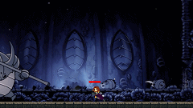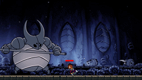

第三阶段

​	当BOSS进入第三阶段，会比前面两个阶段多100点血量。同时增加疯狂乱砸变招，伴随镜头抖动和生成火球，火球砸在玩家身上会扣血；

​	同时还增加跳跃攻击变招；

   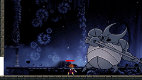

创新点🤓

​	我在之前代码的基础上，为boss设计了一个全新行为，即被玩家反击。当被玩家反击，boss会倒退；

### 2.2行为树+状态机实现逻辑

​	因为一开始的BOSS战，我是用状态机来实现的，所以保留了这部分的代码。当我学习Behavior Designer的时候，发现行为树的实现逻辑和状态机有很多不一样。首先行为树的更新是在TaskStatus 的OnUpdate方法。而最初的状态机使用的是方法，两者的调用顺序不一样，会造成错位。

​	**如果用状态机，那么BOSS达不到智能（或者说达到智能的程度要手工增加很多代码），而如果使用行为树那么前面积累的代码都不能用了。**

​	后来我想出了一个折中的办法，因为状态机的更新其实是通过stateMachine.currentState.Update()更新，而这部分代码是通过MonoBehaviour下的Update调用的，也就是说将这个方法转移到TaskStatus 的OnUpdate下也可以实现状态机的更新，那么问题就解决了。代价就是一个或多个状态机配备一个或多个Task脚本进行驱动。

​	而BOSS的分阶段设计，本质上是根据Behavior Tree自带的Random Selector实现的，我参考https://www.youtube.com/watch?v=X7VwAGvAOIw这个博主的方法，重写了Random Selector，在此基础上实现了分阶段选择行为器，即StageBasedSelector。

为避免有人误会，在此注意。我只参考了这个视频博主的BOSS战设计思路和选择器的实现，并未搬运代码。因为这个博主的BOSS战实现是纯靠行为树脚本来实现的，和我的基于状态机的代码完全不一样。可以通过对比动画状态机就能看出来

​	分阶段选择行为器在Random Selector基础上实现，主要是根据Random Selector根据获取下面子节点的索引，再随机执行。那么可以在此基础上设计一个序列，存放子节点索引，通过共享一个CurrentState，为不同阶段设置不同的索引，即可实现分阶段随机选择行为。

## 三、队友AI设计

待施工🚧

